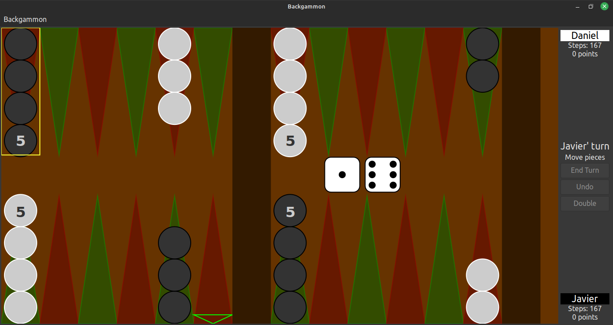
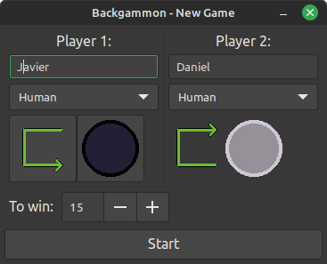

# Backgammon
*(Backgammon game implemented in Gtk+3.0)*

***(New)***: Translation to Spanish and French

- Make sure update translation module:
```sh
$ make transl_update
```

- Compile and Run:
```sh
$ make && make run
```


---

